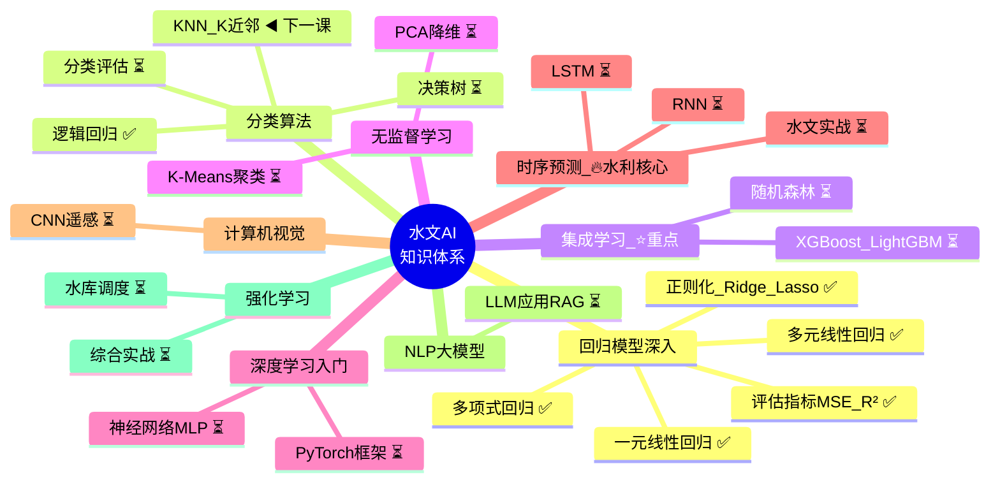

# 🧠 AI学习路线图 — 水文与水资源工程方向



---

## 📊 进度总览

```
第1站 回归模型深入  ████████████████████░░░░  100% ✅
第2站 分类算法      ██████░░░░░░░░░░░░░░░░░   25% ◀️ 当前
第3站 集成学习      ░░░░░░░░░░░░░░░░░░░░░░░    0%
第4站 无监督学习    ░░░░░░░░░░░░░░░░░░░░░░░    0%
第5站 深度学习入门  ░░░░░░░░░░░░░░░░░░░░░░░    0%
第6站 时序预测 ⭐   ░░░░░░░░░░░░░░░░░░░░░░░    0%
第7站 计算机视觉    ░░░░░░░░░░░░░░░░░░░░░░░    0%
第8站 NLP大模型     ░░░░░░░░░░░░░░░░░░░░░░░    0%
第9站 强化学习+实战 ░░░░░░░░░░░░░░░░░░░░░░░    0%
```

> **总进度:** ███░░░░░░░░░░░░░░  约 **7/23课 (30%)**
> **已完成:** 线性回归 → 多元回归 → 多项式回归 → 正则化 → **逻辑回归 ✅**
> **下一课:** KNN（K近邻）

---

## 📁 代码目录结构

```
E:\AI_Projects\
├── 📁 4_matplotlib基础/        ← 折线图、散点图（基础练习）
│   ├── 4.2_01_折线图.py
│   ├── 4.2_02_散点图.py
│   └── 4.2-04_figure.py
│
├── 📁 5_多元线性回归/           ← 评估指标、手写+调库+练习题
│   ├── 5_1 回归评估指标.py
│   ├── 5_2 多元线性回归.py
│   ├── 5_3_多元线性回归_sklearn.py
│   ├── 5_3_练习题_多元线性回归.py
│   └── 手写线性回归.py
│
├── 📁 6_多项式回归/
│   ├── 6_1_多项式回归.py
│   ├── 6_2_多项式回归_调库版.py
│   └── 6_练习题_多项式回归.py
│
├── 📁 7_正则化/
│   ├── 7_1_正则化_Ridge手写.py
│   ├── 7_2_正则化_RidgeLasso_调库版.py
│   └── 7_3_正则化_三种回归对比演示.py
│
├── 📁 8_逻辑回归/
│   ├── 8_1_逻辑回归_手写版.py          ← 手写Sigmoid+梯度下降
│   ├── 8_2_逻辑回归_调库版.py          ← sklearn三行
│   ├── 8_3_逻辑回归_真实数据演示.py    ← 乳腺癌30特征
│   ├── 8_4_逻辑回归_糖尿病预测.py      ← Pima糖尿病
│   ├── 8_5_逻辑回归_决策边界.py        ← 决策边界可视化
│   ├── 8_6_逻辑回归_暴雨预测.py        ← ⭐北京10年暴雨
│   ├── 8_7_线性vs逻辑回归对比.py       ← 线性回归vs逻辑回归
│   ├── 8_8_阈值调优.py                ← 漏报/空报权衡
│   └── 8_练习题_逻辑回归.py           ← 鸢尾花练习
│
├── 📁 项目实战/
│   ├── 项目实战_中国城市气温预测.py
│   ├── 项目实战_水文径流预测.py
│   └── 项目实战_真实水文数据径流预测.py
│
├── 📄 学习进度思维导图.md               ← 本文件
└── 📄 CLAUDE.md                        ← 配置文件
```

---

## 🎯 各站详细说明

### 第1站：回归模型深入 ✅ 已完成
| 课程 | 内容 | 水利场景 |
|:----|:-----|:---------|
| 一元线性回归 | 1个X预测Y | 降雨→径流 |
| 评估指标 | MSE、RMSE、MAE、R² | 模型好坏判断 |
| 多元线性回归 | 多个X预测Y | 多因子预测径流 |
| 多项式回归 | 非线性关系 | 降雨-径流非线性 |
| 正则化 | Ridge/Lasso防过拟合 | 多因子水文模型 |

### 第2站：分类算法 ◀️ 进行中

| # | 课程 | 状态 | 水利场景 |
|:-:|:----|:----:|:---------|
| 1 | **逻辑回归** | ✅ 完成 | 暴雨/洪水预警 |
| 2 | **KNN K近邻** | ◀️ **下一课** | 相似流域预测 |
| 3 | 决策树 | ⏳ | 旱情等级判定 |
| 4 | 分类评估指标 | ⏳ | 模型评估 |

### 第3站：集成学习 ⭐
| 课程 | 说明 | 水利场景 |
|:----|:----|:---------|
| 随机森林 | 多棵树投票 | 径流/泥沙预测 |
| XGBoost | 竞赛冠军算法 | 洪水预报（高频） |

### 第4~9站：🔄 后续
- 深度学习 → LSTM时序预测（**水利核心🔥**） → 遥感 → 大模型 → 综合实战

---

## ⏱ 预计完成时间

| 频率 | 完成时间 |
|:----:|:--------|
| 每周1次 | 约4个月（年底前） |
| 每周2次 | 约2个月（8月底） |
| 每周3次 | 约1个月（7月中） |

---

> **下一课：KNN（K近邻）**——"近朱者赤近墨者黑"，说"继续"就开始！
